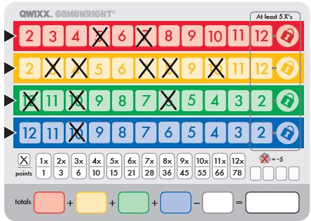
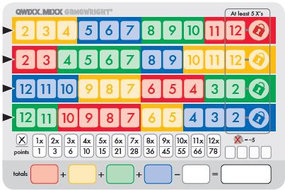

# Qwixxboard! (using React)

This project was bootstrapped with [Create React App](https://github.com/facebook/create-react-app).

## What is Qwixx?

Qwixx is a dice-rolling game my family and friends like to play. Unfortunately, the scoreboards that came with the game get permanent marks too easily, and the only app I could find on Google Play is in another language. So, here I am making a version in English!

## The end-goal

The end-product will need to look something like this:



Eventually, it would be fun to add "advanced" versions of the board, like this:



## The rules

Basically, as dice get rolled, the player has the option to click squares, which then get marked "X" and add to score depending on how many "X"s there are in each row.

The detailed rules can be found [here](https://www.ultraboardgames.com/qwixx/deluxe.php).

## React Components

With the above images in mind, this is a list of components I will probably need to create:

- The background/board as a whole
- Rows for each color
- Boxes to be filled with numbers, then covered with an "X"
- The "lock" circle for the end of each row (or possibly just use the same or similar component as the numbers)
- An extra row to summarize scoring (no functionality required--this could just be an image possibly)
- Boxes for totals
- Boxes for "penalties"

## Game logic

Essentially, every time a player marks off a box with an "X" (in our case, clicking a box), it should make every box to the left of that "X" unclickable. Each row will need a counter to stand for "How many boxes have an 'X' in this row".

The second part of the game logic is that the box all the way on the right is not allowed to be clicked on until there are at least 5 other "X"s in the row. If someone is able to mark the last box, the "lock" symbol at the very end also gets an "X" and counts for scoring.

## Scoring

For each row, every new mark lets you add the current number of marks to the score for that row. For example, if you have 5 marks, your score for the row will be 5+4+3+2+1.

This is accomplished nicely in the following function in the score script:
```javascript
function scorerow(numberofmarks) {
    let score = 0;
    while (numberofmarks > 0) {
        score += numberofmarks;
        numberofmarks--;
    };
    return score
}
```

## Bonus features

There are 2 features I think would be very practical, but I am considering them low priority for now while I get ready to have a basic functioning scoreboard to turn in as a portfolio project: an "undo" button and preventing progress from getting lost if you accidentally hit refresh.

The undo button is ironically very doable--but to implement it programatically may be more time intensive to figure out than I'm willing to put in. Better to get it working without the "undo" feature first, but keep it in the back of my mind.

As far as the page not starting over on refresh, I'm not sure if my program will be going over storing information with the client at this stage, so that may require extracurricular research or I may need to come back to it later in the program.